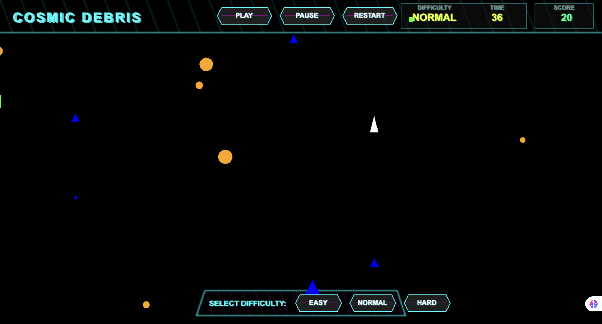

# 🚀 Cosmic Debris Collector

A fast-paced space game built with PixiJS where you pilot a spaceship to collect cosmic debris floating through space.



## 🎮 Game Features

- Control a spaceship with arrow keys
- Collect different types of space debris (circles, squares, triangles)
- Score points for each piece of debris collected
- 60-second time limit
- Responsive design that adapts to your screen size
- Smooth animations and physics

## 🛠️ Technologies Used

- [PixiJS](https://pixijs.com/) - Fast 2D rendering engine
- [Vite](https://vitejs.dev/) - Next Generation Frontend Tooling
- HTML5 Canvas
- JavaScript (ES6+)

## 🚀 Getting Started

### Prerequisites

- Node.js (v14 or higher)
- npm (Node Package Manager)

### Installation

1. Clone the repository:

```bash
git clone https://github.com/yourusername/cosmic-debris-collector.git
cd cosmic-debris-collector
```

2. Install dependencies:

```bash
npm install
```

3. Start the development server:

```bash
npm start
```

4. Open your browser and navigate to `http://localhost:5173`

### Building for Production

To create a production build:

```bash
npm run build
```

The built files will be in the `dist` directory.

## 🎯 How to Play

1. Use the arrow keys to control your spaceship:

   - ⬆️ Move up
   - ⬇️ Move down
   - ⬅️ Move left
   - ➡️ Move right

2. Collect as many pieces of debris as possible within 60 seconds
3. Different debris shapes are worth 10 points each
4. Try to achieve the highest score before time runs out!

## 🎨 Game Objects

- **Spaceship**: White triangle controlled by the player
- **Debris Types**:
  - 🟠 Orange circles
  - 🟢 Green squares
  - 🔵 Blue triangles

## 🔧 Customization

You can modify various game parameters in `game.js`:

- Initial time limit (`timeLeft`)
- Debris spawn rate
- Movement speed
- Score per debris
- Maximum number of debris on screen

## 📝 License

This project is licensed under the MIT License - see the [LICENSE](LICENSE) file for details.

## 🤝 Contributing

Contributions are welcome! Feel free to submit issues and pull requests.

1. Fork the repository
2. Create your feature branch (`git checkout -b feature/AmazingFeature`)
3. Commit your changes (`git commit -m 'Add some AmazingFeature'`)
4. Push to the branch (`git push origin feature/AmazingFeature`)
5. Open a Pull Request

## 🎮 Future Enhancements

- [ ] Add sound effects and background music
- [ ] Implement power-ups
- [ ] Add different difficulty levels
- [ ] Create a high score system
- [ ] Add particle effects for collisions
- [ ] Implement mobile touch controls

## 👥 Credits

Created by Ashirbad - Feel free to contact me!
